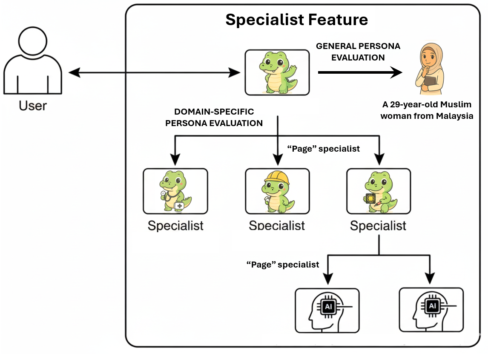
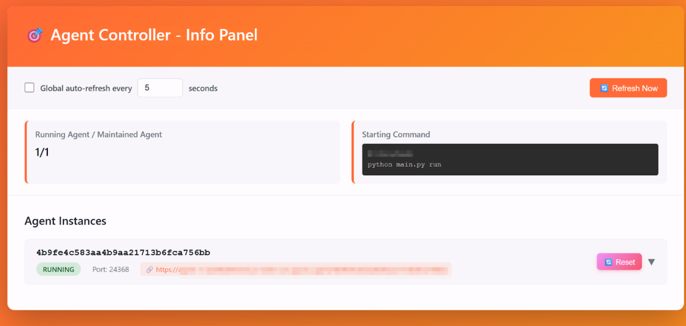
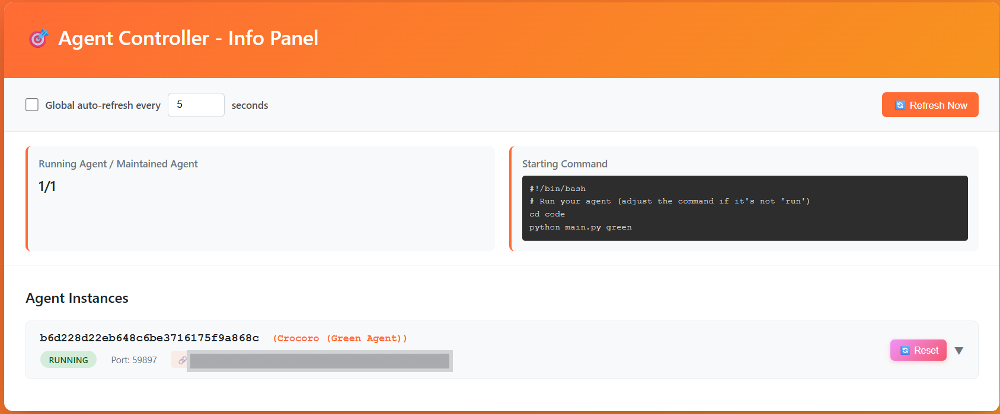
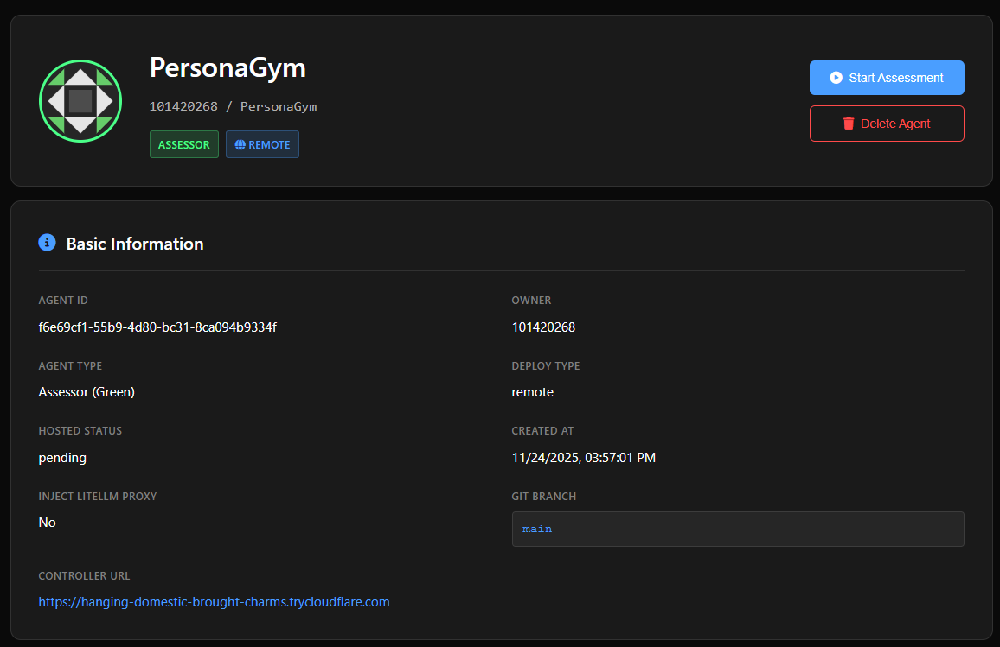
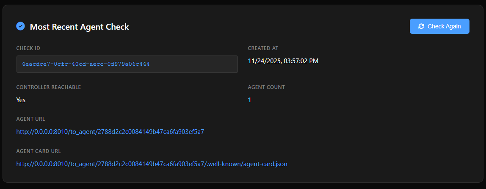

## agent-beat-personagym
Green and White Agent implementation built on top of the a2a framework for PersonaGym, and integrate to the Agent-Beat platform. The Persona Gym codebase is refactored to reflect the suggested format by the AgentBeat developer. 

## Prerequisites

- Python 3.13 or higher (the latest earthshaker requirement)
- Access to a terminal or command prompt.
- Git, for cloning the repository.
- A code editor (e.g., Visual Studio Code) is recommended.

## Python Environment & SDK Installation

We recommend using a virtual environment for Python projects. The A2A Python SDK uses `uv` for dependency management, but you can use `pip` with `venv` as well.

1. **Create and activate a virtual environment:**

    Using `venv` (standard library):

    === "Mac/Linux"

        ```sh
        python -m venv .venv
        source .venv/bin/activate
        ```

    === "Windows"

        ```powershell
        python -m venv .venv
        .venv\Scripts\activate
        ```

2. **Install needed Python dependencies along with the A2A SDK and its dependencies:**

    ```bash
    pip install -r requirements.txt
    ```

## Verify Installation

After installation, you should be able to import the `a2a` package in a Python interpreter:

```bash
python -c "import a2a; print('A2A SDK imported successfully')"
```

If this command runs without error and prints the success message, your environment is set up correctly.

## Project Structure

```
project-root/
├── code/                     # Core agent logic, scripts, and HTML tools
│   ├── green_agent/
│   ├── white_agent/
│   ├── ...
│   └── ...
├── image/                    # Images used in documentation or UI
├── prompts/                  # Prompt templates used in evaluations
├── questions/                # Evaluation or benchmark question sets
├── rubrics/                  # Rubric files for scoring and evaluation
├── specialist_questions/     # Specialist-specific question sets
├── specialists/              # Specialist JSON configurations
├── run.sh                    # Shell script to run the project
├── requirements.txt          # Python dependencies
├── Procfile                  # Deployment configuration
├── LICENSE                   # Project license
└── README.md                 # Project documentation
```

## New Feature - Specialists for Domain-Specific Questions

The Persona Gym benchmark now can use specialist functuons - with domain-specific questions to test the persona agent. To add a custom specialist, you may need to prepare a specialist .json file, a set of domain specific questions and a new rubrics:



#### Step 1: Add a specialist
Create a specialist configuration as a `.json` file and save it in the `specialists/` folder.

#### Step 2: Add domain-specific questions
Create a list of domain-specific questions and save it in the `specialist_questions/` folder.

#### Step 3: Add a domain-specific rubric
Create a new domain-specific rubric and save it in the `rubrics/` folder.

## Run the code (command prompt)

To run and test the Persona Agent in the command prompt, please use the following command:

```bash
python main.py launch
```

We have provided 3 white agent examples (Refer to the final submission report) to test the dynamic benchmark. To use them for tests, just simply copy their persona description and replace the persona description in the white_agent_card.toml in the `white_agent/` folder.

Note that we also provide a static benchmark for testing a general LLM model, please use the following to run static benchmark:

```bash
python main.py launch --static
```

Please note the evaluation for one persona can take up to around 15 to 20 min for 10 questions per task. Also, remember to set up the OepnAI API key or other LLM API keys:

```bash
export OPENAI_API_KEY="your_api_key_here"
```

Instead of setting env variables, you may also directly copy the key to `api.py`.

## Launch the AgentBeat controller 

Run the following command to start the controller:
```
agentbeats run_ctrl
```
Once it’s running, you should see a local management page similar to the one shown below. From there, you can also access your agent through the proxy URL provided by the controller — for example, try checking whether `.well-known/agent-card.json` can be successfully fetched.



In case you want to use the Green Agent and the static benchmark to test a general LLM model, please modify the `run.sh` with the following command:
```
python main.py greenstatic
```
Run the following command to start the controller again:
```
agentbeats run_ctrl
```
This time the Green Agent will use the static benchmark.

## Deployment of the Agent to Google Server

Following the instructions from the AgentBeats blog, we registered for a Google Cloud account and used it to host our green agent. The deployment was successful, and we received a public HTML URL:



The agent card can be successfully fetched:


Now, we can use AgentBeat platform for agent assessment.



